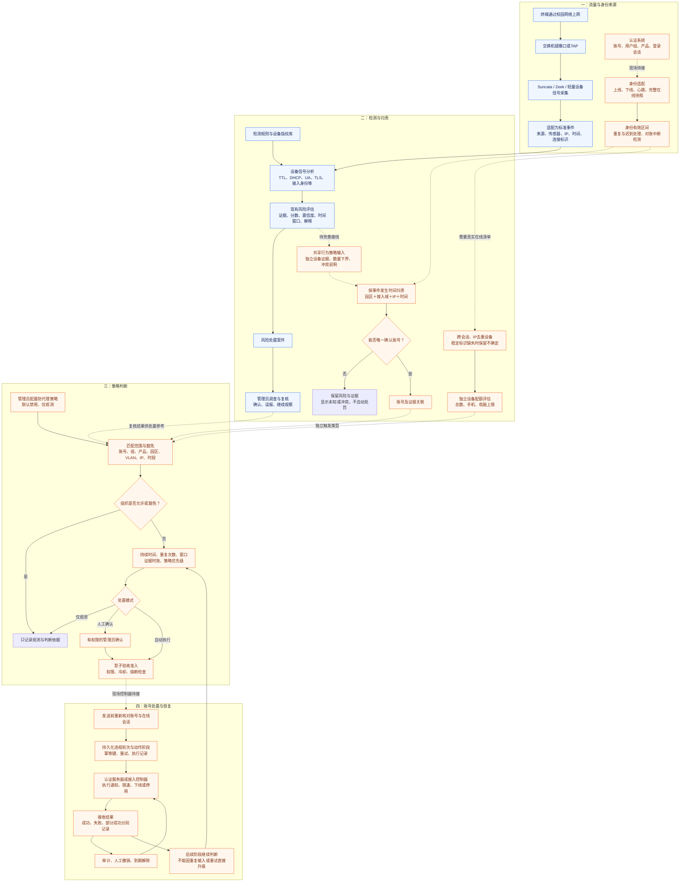
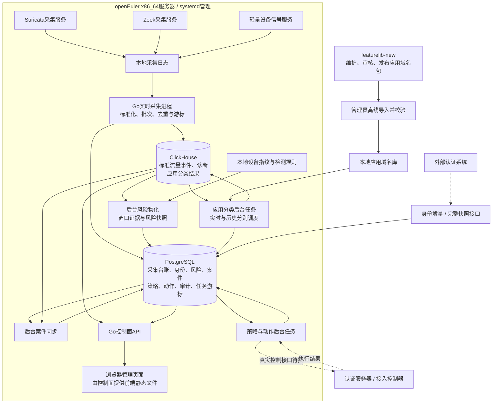
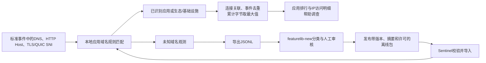

# 共享上网检测与处置：完整流程及依赖

以2026-09-15代码和当日现场核验为依据。主线是共享行为检测和违规处置，VPN检测暂缓。图中的待接通环节是目标流程，不能解释为现场已经可以处罚。

## 一、业务主流程

蓝色为已运行的检测与复核路径；橙色为目标闭环中的环节，部分已有代码，仍依赖现场接入或联调。虚线明确标出尚未接通的关键链路。确认风险不等于已有处罚授权。

同一账号登录多台设备超出配额，与同一出口后面存在共享行为分别判断。只能看到出口MAC时不能据此数清其后设备；应用访问、品牌或单一TTL/UA信号不单独确认共享。

## 二、软件、进程及数据库依赖

生产运行依赖Go编译后的程序、前端静态文件、PostgreSQL、ClickHouse及采集器。当前数据库由Docker运行，应用和采集任务由systemd管理。Go、Node.js、pnpm用于开发和构建，不要求在目标机运行前端开发服务器。文件模式保留给开发与回放。

当前部署是旁路镜像检测：采集服务器能看流量，但不因此具备切断用户网络的能力。实际限制必须依赖已接入且具备对应能力的认证系统/控制器。

## 三、应用统计是一条辅助分支

这条分支不是共享处罚的前置依赖。特征库不负责解析全部网络协议，也不负责认定违规。DNS只计域名观测；同一连接多应用的流量单独计量，不能分给多个应用重复累计。

## 四、依赖与缺失影响

| 能力 | 必须依赖什么 | 缺少时的结果 | 现场状态（2026-09-15核验） |
| --- | --- | --- | --- |
| 看到网络行为 | 正确的镜像位置、网卡、采集器、时间与传感器标识 | 无数据或视野不完整，不能把未发现解释为没有共享 | 采集链路运行中 |
| 判断共享风险 | 可见的独立设备信号、检测规则、证据窗口 | 单一弱信号只能提示，无法可靠确认共享 | 已有检测/证据框架，完整shared_access输入待接 |
| 把风险归给账号 | 认证会话、园区/接入域、事件时间、完整对账 | 只能保留IP风险，不能自动归责 | 认证会话0、完整快照来源0 |
| 判断设备配额 | 权威在线清单、稳定设备标识、显式配置上限 | 只能给下界或未知，不能虚构准确台数 | 评估代码已有，实际身份输入未接 |
| 决定如何处理 | 已启用的组织策略、豁免、持续条件及模式 | 风险保留，不构成自动处罚指令 | 页面已恢复，现场策略定义0 |
| 真正限速/下线 | 控制器接口、凭证、能力映射、唯一账号/会话 | 只有记录/影子模拟，不能实际断网 | 启用连接器0，已有沙箱验证 |
| 可靠解除与重试 | 持久化状态、幂等、控制结果、租约与审计 | 可能重复或误解除，必须先验收 | 有代码，现场多会话/叠加限制待验 |
| 应用访问统计 | 本地域名库、标准连接与流量字段、CH分类结果 | 未知率高或计量不可用，不妨碍保留共享风险 | 61条试点规则；实时分类正常，历史补扫受内存限制 |
| 长期稳定运行 | PG/CH容量、保留策略、监测、备份、任务资源限制 | 积压、查询变慢或空间不足 | 根盘90%，设备快照增长需治理 |

## 五、完整替代前的实际推进顺序

1. 补齐共享行为到shared_access策略的输入和正反回放。
2. 接认证源与完整在线清单，补账号详情及归属解释；同时修复历史补扫和容量问题。
3. 配置明确的共享策略和独立设备配额，先观测/试算，再人工确认。
4. 接真实控制器，在受控账号上验证限速、下线、解除和部分失败。
5. 达到既有影子准入与现场准确性门槛后，再按授权启用自动模式。VPN检测不作为以上工作的前置条件。

相关依据：`docs/shared-access/current-priority.md`、`docs/account-policies/identity-reconciliation.md`、`docs/account-policies/implementation-status.md`、`docs/deployment-and-gaps-20260915.md`、`docs/policy-page-loading-fix-20260915.md`及当前策略消费者代码。
